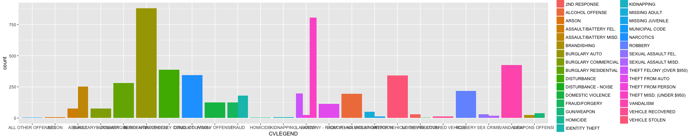
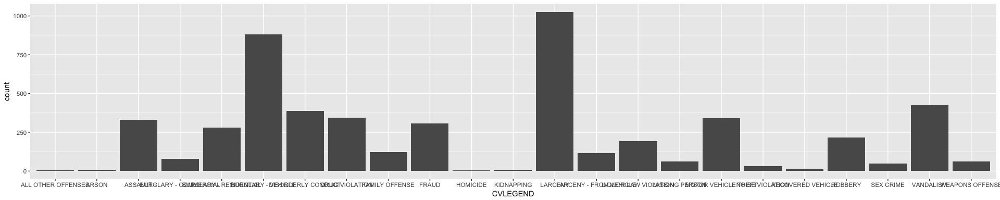

___
title: 'Mapping and Visualizing Crime Reports in Berkeley'
___

#Introduction

#The Data


```r
library(dplyr)
```

```
## 
## Attaching package: 'dplyr'
```

```
## The following objects are masked from 'package:stats':
## 
##     filter, lag
```

```
## The following objects are masked from 'package:base':
## 
##     intersect, setdiff, setequal, union
```

```r
library(readr)
library(lubridate)
```

```
## 
## Attaching package: 'lubridate'
```

```
## The following object is masked from 'package:base':
## 
##     date
```

```r
library(ggplot2)
```

```
## Warning: package 'ggplot2' was built under R version 3.3.2
```

```r
library(ggmap)

train <- 
  read_csv(file='BerkeleyPD.csv')
```

```
## Parsed with column specification:
## cols(
##   CASENO = col_integer(),
##   OFFENSE = col_character(),
##   EVENTDT = col_character(),
##   EVENTTM = col_time(format = ""),
##   CVLEGEND = col_character(),
##   CVDOW = col_integer(),
##   InDbDate = col_character(),
##   Block_Location = col_character(),
##   BLKADDR = col_character(),
##   City = col_character(),
##   State = col_character()
## )
```

```r
unique(train$CVLEGEND)
```

```
##  [1] "ASSAULT"                "FRAUD"                 
##  [3] "BURGLARY - VEHICLE"     "FAMILY OFFENSE"        
##  [5] "MISSING PERSON"         "LARCENY - FROM VEHICLE"
##  [7] "BURGLARY - RESIDENTIAL" "LARCENY"               
##  [9] "DISORDERLY CONDUCT"     "RECOVERED VEHICLE"     
## [11] "ROBBERY"                "MOTOR VEHICLE THEFT"   
## [13] "LIQUOR LAW VIOLATION"   "VANDALISM"             
## [15] "SEX CRIME"              "DRUG VIOLATION"        
## [17] "WEAPONS OFFENSE"        "NOISE VIOLATION"       
## [19] "BURGLARY - COMMERCIAL"  "KIDNAPPING"            
## [21] "HOMICIDE"               "ARSON"                 
## [23] "ALL OTHER OFFENSES"
```

```r
ggplot(data = train) +  
  geom_bar(mapping = aes(x = CVLEGEND, fill = OFFENSE), position = "dodge")
```

<!-- -->

```r
ggplot(data = train) +  
  geom_bar(mapping = aes(x = CVLEGEND), position = "dodge")
```

<!-- -->


